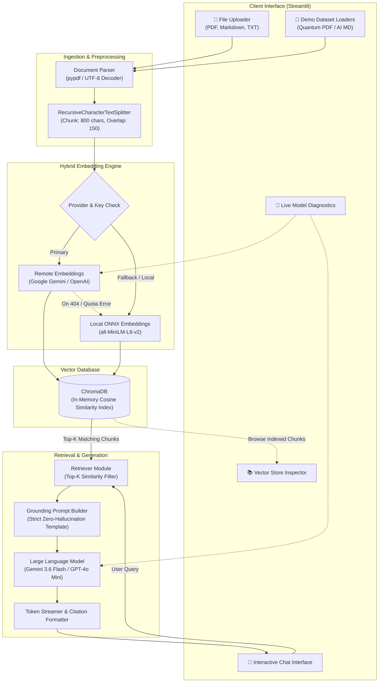
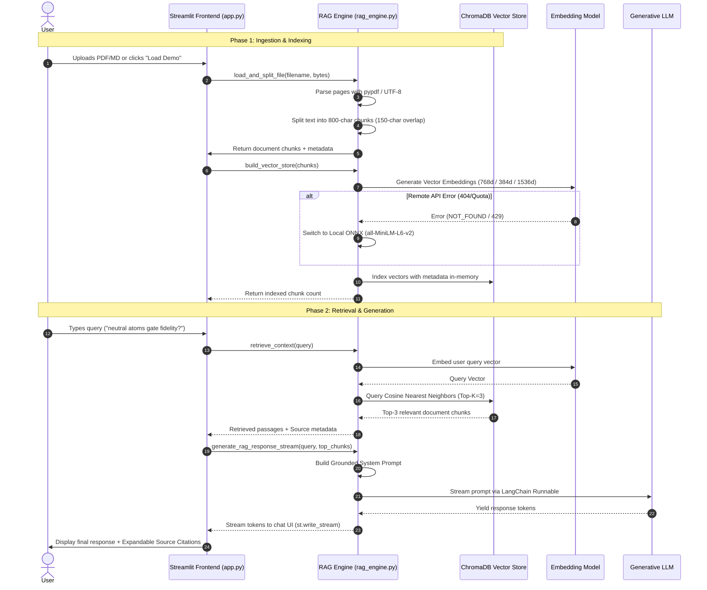

# 🏛️ System Architecture & Engineering Deep-Dive

Welcome to the architectural specification for **Streamlit RAG Explorer**. This document provides an exhaustive breakdown of the system components, data pipelines, vector indexing mechanics, failure recovery strategies, and conversational state management.

---

## 📑 Table of Contents
1. [High-Level System Architecture](#1-high-level-system-architecture)
2. [End-to-End Execution Sequence](#2-end-to-end-execution-sequence)
3. [Component Deep-Dive](#3-component-deep-dive)
   - [A. Document Ingestion & Parsing](#a-document-ingestion--parsing)
   - [B. Chunking Strategy](#b-chunking-strategy)
   - [C. Hybrid Resilient Embedding Engine](#c-hybrid-resilient-embedding-engine)
   - [D. In-Memory ChromaDB Vector Index](#d-in-memory-chromadb-vector-index)
   - [E. Semantic Retrieval & Context Formatting](#e-semantic-retrieval--context-formatting)
   - [F. Augmented Prompt Engineering & Streamed Generation](#f-augmented-prompt-engineering--streamed-generation)
4. [Resilience & Fallback Matrix](#4-resilience--fallback-matrix)
5. [Streamlit Session State Lifecycle](#5-streamlit-session-state-lifecycle)

---

## 1. High-Level System Architecture

The following diagram illustrates how raw documents are transformed into vector embeddings, indexed in memory, and used to augment real-time queries sent to Large Language Models.



---

## 2. End-to-End Execution Sequence

The complete chronological lifecycle of a user query is shown below:



---

## 3. Component Deep-Dive

### A. Document Ingestion & Parsing
The ingestion layer normalizes incoming files into a unified LangChain `Document` format with metadata tracking:
- **PDF Files**: Ingested via `pypdf.PdfReader` with stream buffering (`io.BytesIO`). Page numbers are automatically attached to the metadata dictionary (`metadata={"source": filename, "page": page_number}`).
- **Markdown & Plain Text Files**: Decoded with UTF-8 (`errors="ignore"` to prevent encoding crashes) and marked as page 1.

### B. Chunking Strategy
Natural language documents cannot be ingested as one monolithic block due to LLM context limits and embedding dilution.
We use `RecursiveCharacterTextSplitter` with the following parameters:
- **`chunk_size` = 800 characters**: Provides optimal semantic density without exceeding the optimal context window of embedding models.
- **`chunk_overlap` = 150 characters**: Ensures sentences that span across chunk boundaries are not truncated or lost.
- **Separator Hierarchy**: `["\n\n", "\n", ". ", " ", ""]` (splits on paragraphs first, then sentences, then words).

### C. Hybrid Resilient Embedding Engine
Embedding models convert arbitrary text strings into dense floating-point vectors where semantic similarity corresponds to geometric proximity:

$$\text{Cosine Similarity}(\mathbf{u}, \mathbf{v}) = \frac{\mathbf{u} \cdot \mathbf{v}}{\|\mathbf{u}\|_2 \|\mathbf{v}\|_2}$$

To eliminate cloud API vulnerabilities (e.g. `404 NOT_FOUND` for deprecated embedding model endpoints or strict API key quota tiers), the system implements a **2-Tier Hybrid Strategy**:
1. **Tier 1 (Cloud Embeddings)**:
   - **Google Gemini**: Uses `models/embedding-001` or `text-embedding-004`.
   - **OpenAI**: Uses `text-embedding-3-small` (1536 dimensions).
2. **Tier 2 (Zero-Dependency Local ONNX Fallback)**:
   - If the cloud API fails, the system seamlessly initializes `LocalDefaultEmbeddings` backed by Chroma's bundled `all-MiniLM-L6-v2` ONNX model.
   - Runs locally in Python on CPU/Metal with zero network latency and zero costs.

### D. In-Memory ChromaDB Vector Index
- Embedded directly inside the Streamlit Python process.
- No external Docker container, database server, or disk persistence required.
- Fast nearest-neighbor search using Hierarchical Navigable Small World (HNSW) graph indexing.

### E. Semantic Retrieval & Context Formatting
When a user asks a question:
1. The question is embedded using the exact same model that embedded the document chunks.
2. The Top-$k$ chunks (default: $k=3$) with the highest cosine similarity are extracted.
3. Chunks are assembled into a formatted context block including source file names and page numbers:
   ```text
   [Source: quantum_computing_report.pdf (Page 1, Chunk #3)]
   • Neutral Atoms: QuEra, Pasqal | Coherence: 1-10s | Gate Fidelity (2Q): 99.5%
   ```

### F. Augmented Prompt Engineering & Streamed Generation
The assembled context and user query are injected into a strict system prompt:

```text
You are an expert, helpful AI assistant analyzing user-provided documents using Retrieval-Augmented Generation (RAG).
Answer the user's question accurately using ONLY the retrieved context below.
If the context does not contain the answer, politely state that the provided documents do not contain sufficient information.
Cite your sources with chunk/page numbers when referencing specific facts.

CONTEXT:
{context}
```

The response is streamed in real-time token-by-token using `st.write_stream` to maximize perceptual responsiveness for the user.

---

## 4. Resilience & Fallback Matrix

| Failure Mode | Root Cause | System Recovery Action | User Experience Impact |
| :--- | :--- | :--- | :--- |
| **Embedding 404 / Quota Error** | Deprecated model or restricted API key scope | Automatically switches to `LocalDefaultEmbeddings` (ONNX `all-MiniLM-L6-v2`) | **Zero interruption**; document indexes successfully with a status chip update. |
| **LLM Model Deprecation (404)** | API version phase-out (e.g. `gemini-2.5-flash`) | Automatic runtime fallback loop through stable models (`gemini-3.6-flash` ➔ `gemini-1.5-flash` ➔ `gemini-1.5-pro`) | **Zero interruption**; answers stream smoothly. |
| **Empty Vector Database Query** | User queries before indexing documents | Intercepted in UI with friendly warning prompt | Clear guidance to upload documents or click 1-click demo button. |
| **Unreadable PDF Pages** | Scanned / empty PDF pages | Empty pages filtered out before text chunking | Clean index with zero empty vector nodes. |

---

## 5. Streamlit Session State Lifecycle

Streamlit executes scripts top-to-bottom on every interaction. To persist the conversational state and vector store across re-runs, the following keys are managed in `st.session_state`:

| State Variable | Type | Purpose |
| :--- | :--- | :--- |
| `st.session_state.messages` | `List[Dict]` | Stores complete chat history, user queries, assistant replies, and source citation metadata. |
| `st.session_state.rag_engine` | `RAGEngine` | Holds active instances of embedding models, LLM chain, and ChromaDB vector store. |
| `st.session_state.indexed_chunks` | `List[Document]` | Raw chunks preserved for inspection in the Vector Store Explorer tab. |
| `st.session_state.indexed_files` | `List[str]` | Names of all active files contributing to the knowledge base. |
| `st.session_state.total_chunks_count` | `int` | Real-time counter of indexed chunks. |
| `st.session_state.embedding_info` | `str` | Name of the active embedding engine (Remote vs Local ONNX). |
