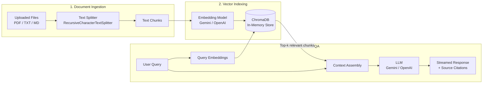

<div align="center">

# 🚀 Streamlit RAG Explorer

### A Modern, Production-Ready Retrieval-Augmented Generation Starter App

[](https://share.streamlit.io/)
[](https://www.python.org/downloads/)
[](https://www.langchain.com/)
[](https://opensource.org/licenses/MIT)
[](https://ai.google.dev/)
[](https://openai.com/)

<p align="center">
  <b>Chat with your PDF, Markdown, and TXT documents with real-time source citations and zero hallucinations.</b>
  <br />
  Built with <b>Streamlit</b>, <b>LangChain</b>, and in-memory <b>ChromaDB</b>. Designed for 1-click deployment on <b>Streamlit Community Cloud</b>.
</p>

</div>

---

## 🌟 Key Features

- ⚡ **Zero-Friction Setup**: In-memory vector database (**ChromaDB**) — no external vector database servers or Docker containers required.
- 🤖 **Multi-Provider Support**:
  - **Google Gemini** (`gemini-3.6-flash`, `gemini-1.5-flash`, `gemini-1.5-pro` + `models/embedding-001`)
  - **OpenAI** (`gpt-4o-mini`, `gpt-4o` + `text-embedding-3-small`)
- 📁 **Multi-Format Ingestion**: Ingest and process **PDFs** (with page tracking), **Markdown**, and **Plain Text** files.
- 🎯 **1-Click Built-in Demo Datasets**: Test immediately with pre-loaded sample documents (Multi-page **PDF Technical Report** on Quantum Computing and **Markdown Guide** on Autonomous AI Agents) without needing to upload files.
- 🔍 **Interactive Source Citations**: Inspect exact chunk passages and page references for every generated answer.
- 🎛️ **Live Hyperparameter Tuning**: Adjust chunk size, chunk overlap, retriever Top-$k$, and model temperature directly from the sidebar.
- 📚 **Vector Store Inspector**: Search and explore all chunked documents and metadata in real-time.
- 🚀 **Streamlit Cloud Ready**: Clean structure, pinned dependencies, `.streamlit/config.toml`, and `.env` template.

---

## 📐 Architecture Overview



---

## 📂 Repository Structure

```
RAG_Using_AG/
├── .streamlit/
│   └── config.toml                              # Custom dark UI theme & Streamlit server settings
├── sample_data/
│   ├── quantum_computing_and_ai_report.pdf     # Built-in demo technical whitepaper (PDF)
│   └── ai_agents_guide.md                       # Built-in demo knowledge base guide (Markdown)
├── app.py                                       # Main Streamlit web application & UI
├── rag_engine.py                                # Core RAG logic (parsing, chunking, embeddings, vector store, QA chain)
├── config.py                                    # Model configurations, default hyperparameters, constants
├── requirements.txt                             # Pinned Python package dependencies for Streamlit Cloud
├── .env.example                                 # Template for API keys
├── .gitignore                                   # Excludes virtual environments, secrets, and caches
├── LICENSE                                      # MIT Open Source License
└── README.md                                    # Documentation & Deployment Guide
```

---

## 🚀 Quickstart (Local Development)

### 1. Clone the Repository
```bash
git clone https://github.com/YOUR_USERNAME/YOUR_REPO_NAME.git
cd YOUR_REPO_NAME
```

### 2. Create a Virtual Environment
```bash
# macOS/Linux
python3 -m venv venv
source venv/bin/activate

# Windows
python -m venv venv
.\venv\Scripts\activate
```

### 3. Install Dependencies
```bash
pip install -r requirements.txt
```

### 4. (Optional) Configure API Keys in `.env`
Copy `.env.example` to `.env` and enter your API key:
```bash
cp .env.example .env
```
Edit `.env`:
```env
GOOGLE_API_KEY=your_gemini_api_key_here
OPENAI_API_KEY=your_openai_api_key_here
```
> *Note: You can also enter your API key directly in the web app's sidebar!*

### 5. Launch the Streamlit App
```bash
streamlit run app.py
```
Open your browser at `http://localhost:8501`.

---

## ☁️ How to Deploy to Streamlit Community Cloud (Free)

Follow these simple steps to deploy your RAG application online for free:

### Step 1: Push to GitHub
1. Create a new public repository on [GitHub](https://github.com/new).
2. Initialize and push your code:
```bash
git init
git add .
git commit -m "Initial commit: Streamlit RAG Sample"
git branch -M main
git remote add origin https://github.com/YOUR_USERNAME/YOUR_REPO_NAME.git
git push -u origin main
```

### Step 2: Deploy on Streamlit Cloud
1. Go to [share.streamlit.io](https://share.streamlit.io/) and sign in with GitHub.
2. Click **"New app"**.
3. Select your repository: `YOUR_USERNAME/YOUR_REPO_NAME`.
4. Set **Main file path** to `app.py`.
5. Under **Advanced settings**, navigate to **Secrets** and paste your API keys:
```toml
GOOGLE_API_KEY = "your_actual_gemini_key"
OPENAI_API_KEY = "your_actual_openai_key"
```
6. Click **"Deploy!"** 🎈

Your application will be live with a shareable public URL!

---

## 🛠️ Configuration & Hyperparameters

You can customize the RAG pipeline parameters via the sidebar:

| Parameter | Default | Description |
| :--- | :--- | :--- |
| **Provider** | `Google Gemini` | Select between Google Gemini and OpenAI. |
| **Model** | `gemini-1.5-flash` | Select LLM for answer synthesis. |
| **Chunk Size** | `800` | Maximum characters per document segment. |
| **Chunk Overlap** | `150` | Characters shared between consecutive chunks to preserve context. |
| **Retrieved (Top-$k$)** | `3` | Number of most relevant chunks passed to the LLM. |
| **Temperature** | `0.2` | Creativity level of the model (lower = more deterministic & factual). |

---

## ❓ FAQ & Troubleshooting

<details>
<summary><b>1. Where do I get a free API Key?</b></summary>
<ul>
  <li><b>Google Gemini (Free tier available)</b>: Get your key at <a href="https://aistudio.google.com/app/apikey">Google AI Studio</a>.</li>
  <li><b>OpenAI</b>: Get your key at <a href="https://platform.openai.com/api-keys">OpenAI Platform</a>.</li>
</ul>
</details>

<details>
<summary><b>2. Why use in-memory ChromaDB?</b></summary>
In-memory ChromaDB allows the app to be self-contained and run on lightweight cloud platforms (like Streamlit Community Cloud) without provisioning external vector databases or servers.
</details>

<details>
<summary><b>3. How do I add support for more file types (DOCX, CSV)?</b></summary>
You can easily extend <code>rag_engine.py</code> in the <code>load_and_split_file</code> method by adding parsers like <code>python-docx</code> for DOCX or <code>pandas</code> for tabular CSV files.
</details>

---

## 📄 License

This project is licensed under the MIT License - see the [LICENSE](LICENSE) file for details.

---

<div align="center">
  <b>⭐ If you find this project helpful, please give it a star on GitHub! ⭐</b>
</div>
