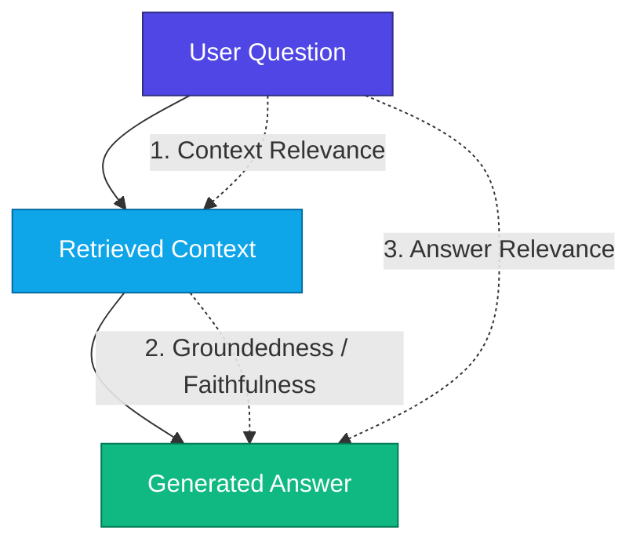

# 🧠 Understanding RAG: The Complete Conceptual Guide

This guide breaks down **Retrieval-Augmented Generation (RAG)** in simple, intuitive terms, explaining why it has become the standard architectural pattern for modern enterprise AI applications.

---

## 🎯 1. The Core Problem: Why do LLMs Hallucinate?

Large Language Models (like GPT-4o or Gemini) are massive statistical neural networks trained on vast archives of internet data. However, they have three fundamental limitations:

1. **Static Knowledge Cutoff**: An LLM only knows information up to the date its training dataset was collected.
2. **No Access to Private Data**: LLMs know nothing about your company's internal documentation, technical whitepapers, or private codebases.
3. **Probabilistic Text Generation (Hallucination)**: LLMs do not "think" or consult a database; they predict the next most likely word ($P(w_t \mid w_{<t})$). When asked about obscure or private facts, they generate plausible-sounding falsehoods.

---

## ⚖️ 2. Solution Comparison: RAG vs. Fine-Tuning vs. Long Context

| Dimension | Standard Prompting | Fine-Tuning | Retrieval-Augmented Generation (RAG) |
| :--- | :--- | :--- | :--- |
| **Private Knowledge Access** | ❌ No | ⚠️ Partial (Baked into weights) |  **Yes (Dynamic vector retrieval)** |
| **Real-Time Data Updates** | ❌ Static | ❌ Requires costly re-training |  **Instant (Update vector index)** |
| **Cost & Compute** |  Low | ❌ Very High (GPU clusters) |  **Very Low (In-memory embedding)** |
| **Source Citations** | ❌ None | ❌ None (Opaque black box) |  **Exact Chunk & Page Citations** |
| **Hallucination Risk** | ❌ High | ⚠️ Moderate |  **Minimal (Strictly grounded)** |

> 💡 **Summary**: Fine-tuning teaches a model a *style or behavior*, whereas RAG gives the model a *reference library* to consult before speaking.

---

## 🧩 3. The 4 Phases of RAG Explained Simply

Imagine you are taking an **open-book exam**. Instead of memorizing an entire encyclopedia before the test, you keep the book on your desk, look up the exact page with the formula when a question is asked, and write down the answer while citing the page. 

That is exactly how RAG operates in 4 distinct phases:

```
[Phase 1: Ingest & Split] ➔ [Phase 2: Embed & Store] ➔ [Phase 3: Search & Retrieve] ➔ [Phase 4: Augment & Generate]
```

---

### Phase 1: Ingestion & Text Chunking
Long documents cannot be processed as a single chunk because:
- Embedding an entire 50-page PDF into a single vector averages out the meaning and loses specific details.
- LLM context windows perform better with concise, high-density passages.

#### Chunking Visualized:
```
Raw Document (3,000 characters)
┌────────────────────────────────────────────────────────┐
│ Paragraph 1: Quantum computing uses qubits...         │
│ Paragraph 2: Superconducting circuits run at 15mK...  │
│ Paragraph 3: Neutral atoms achieve 99.5% fidelity...  │
└────────────────────────────────────────────────────────┘
                           │
                 [Text Splitter: 800 chars]
                           ▼
┌──────────────────┐  ┌──────────────────┐  ┌──────────────────┐
│ Chunk 1 (Chars)  │  │ Chunk 2 (Chars)  │  │ Chunk 3 (Chars)  │
│ Qubits overview  │  │ Overlap (150)    │  │ Overlap (150)    │
│ + Superconductors│  │ + Neutral Atoms  │  │ + NIST Standards │
└──────────────────┘  └──────────────────┘  └──────────────────┘
```

---

### Phase 2: Vector Embeddings & Semantic Spaces
An **Embedding Model** translates natural language into an array of numbers (e.g., 384 or 1536 floating-point values).

In this high-dimensional mathematical space, **concepts with similar meanings are positioned close together**, even if they use completely different words:

```
                  High Dimension Vector Space
                              ▲
                              │     [Chunk #1: "Neutral Atoms 99.5% fidelity"]
                              │                   ●
                              │                  /
                              │   Distance = 0.12 (High Similarity!)
                              │                /
                              │               ●
  [Query: "How accurate       │      [Chunk #2: "Trapped ions 99.92%"]
   are neutral atom gates?"]  ●
                              │
                              │
                              │                      ● [Chunk #7: "Office Coffee Policy"]
                              │                        (Distance = 0.89 -> Ignored)
                              └────────────────────────────────────────►
```

---

### Phase 3: Semantic Retrieval (Cosine Similarity)
When the user types a question:
1. The question is converted into a vector embedding $\mathbf{q}$.
2. The vector database computes the cosine angle between $\mathbf{q}$ and every stored document chunk $\mathbf{d}_i$:

$$\text{Similarity}(\mathbf{q}, \mathbf{d}) = \cos(\theta) = \frac{\mathbf{q} \cdot \mathbf{d}}{\|\mathbf{q}\| \|\mathbf{d}\|}$$

3. The system returns the **Top-$k$ highest-scoring chunks** (e.g. $k=3$).

---

### Phase 4: Grounded Generation (Prompt Augmentation)
The retrieved chunks are formatted and placed directly into the LLM's system prompt:

```markdown
SYSTEM INSTRUCTION:
You are an expert AI answering questions strictly from the provided context.
If the context does not contain the answer, state that information is missing.
Do not make up facts. Cite your sources with page and chunk numbers.

CONTEXT:
---
[Source: quantum_computing_and_ai_report.pdf | Page 1, Chunk #3]
Neutral Atoms (QuEra, Pasqal): Coherence time 1-10s, 2Q Gate Fidelity 99.5%.

USER QUESTION:
What is the gate fidelity of neutral atoms?
```

**LLM Synthesized Output:**
> *"According to the Quantum Computing Report (Page 1, Chunk #3), neutral atom quantum systems developed by QuEra and Pasqal achieve a 2-qubit gate fidelity of **99.5%** with coherence times between 1 to 10 seconds."*

---

## 📊 4. How to Measure RAG Quality: The RAG Triad

In production RAG systems, quality is evaluated using the **RAG Triad**:



1. **Context Relevance**: Did the retriever fetch passages that actually contain the answer without irrelevant noise?
2. **Groundedness / Faithfulness**: Is every sentence in the final answer directly supported by the retrieved context (Zero Hallucination)?
3. **Answer Relevance**: Did the model actually answer the user's question directly, or did it go off on a tangent?

---

## 🛠️ 5. Next-Level RAG Patterns to Explore

Once you master this starter application, here are the advanced architectures used in enterprise systems:

1. **Hybrid Search (Dense + Sparse)**: Combining BM25 keyword matching with vector embeddings to catch exact part numbers, acronyms, and semantic concepts simultaneously.
2. **Re-Ranking**: Retrieving the top 25 chunks and passing them through a Cross-Encoder model (e.g., Cohere Rerank) to re-order the top 3 most relevant passages.
3. **Agentic RAG**: Equipping an autonomous agent with the ability to rewrite queries, search multiple collections, and iteratively critique its own answers.
